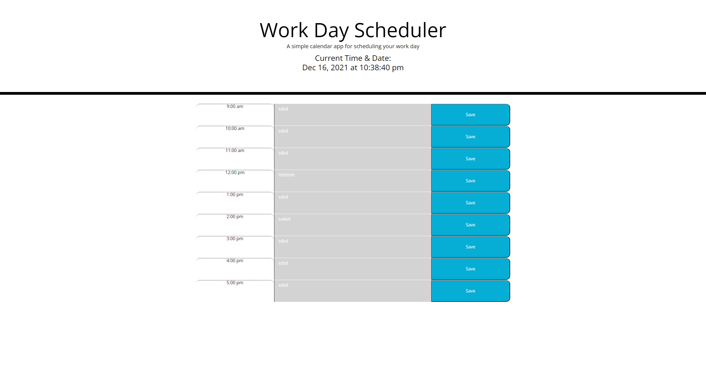

# 05 Third-Party APIs: Work Day Scheduler

# Homework 5
this is a daily calender that give you the date and time. This daily planner change colors depending on what hour you are on (green = future, red = present grey = past). This planner will also save all text you put in the textbox with the save button

